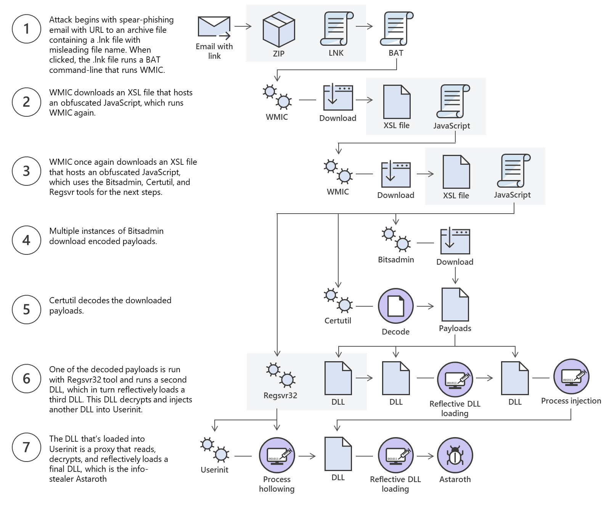

In the hacking filed, the file transfer is very important, checkout this group's file apply when they hack one of the most rich tech company - Microsoft:

[Dismantling a fileless campaign: Microsoft Defender ATP’s Antivirus exposes Astaroth attack](https://www.microsoft.com/en-us/security/blog/2019/07/08/dismantling-a-fileless-campaign-microsoft-defender-atp-next-gen-protection-exposes-astaroth-attack/)

You never know what your next target's environment will be like. Keeping all your gear in your backpack is one of the best methods.

